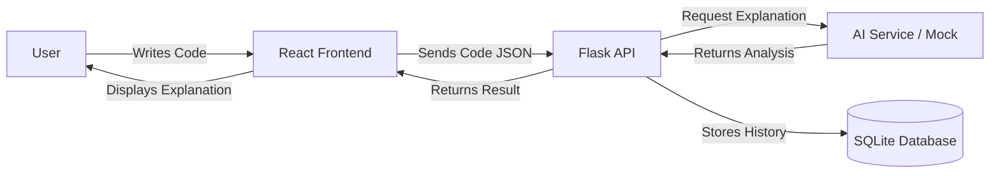
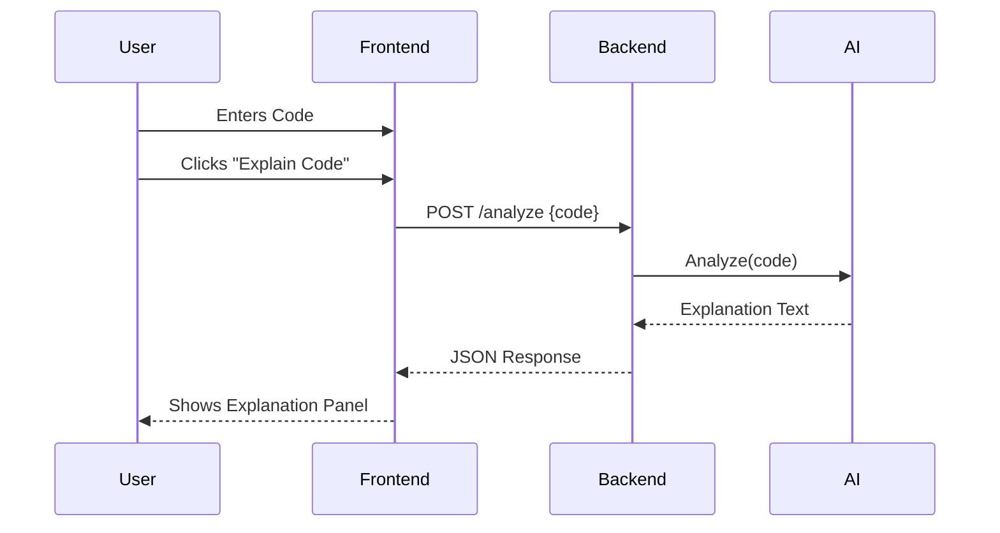

# AI-Based Coding Tutor

An AI-powered coding tutor web application built with **React (Frontend)** and **Flask (Backend)**. This project helps beginners understand code by providing simple explanations, error detection, and suggestions.

## 🚀 Features
- **Smart Code Explanation**: Uses AI to explain code logic in plain English.
- **Error Detection**: Identifies syntax errors and logic bugs.
- **Interactive Editor**: Monaco Editor for a real coding experience.
- **Clean UI**: Modern, split-screen interface for code and results.

## 🛠 Tech Stack
- **Frontend**: React, Vite, Tailwind CSS, Monaco Editor
- **Backend**: Python, Flask, SQLite, OpenAI API
- **Tools**: Git, npm, pip

---

## 🏗 Architecture (Viva Diagram)



## 🔄 User Flow



---

## ⚙️ Setup & Run Guide

### Prerequisities
- Node.js & npm
- Python 3.8+

### 1. Backend Setup
```bash
cd backend
python -m venv venv
# Windows:
.\venv\Scripts\activate
# Mac/Linux:
# source venv/bin/activate

pip install -r requirements.txt
python app.py
```
*Server runs at `http://localhost:5000`*

### 2. Frontend Setup
```bash
cd frontend
npm install
npm run dev
```
*App runs at `http://localhost:5173`*

### 3. AI Configuration
Create a `.env` file in `backend/` and add your API key:
```
OPENAI_API_KEY=your_api_key_here
```
*(If no key is provided, the system runs in Mock Mode for testing)*

---

## 📝 Viva Questions & Answers

**Q: How does the backend communicate with the frontend?**
A: Through REST API endpoints. The frontend sends HTTP POST requests using Axios, and the backend responds with JSON data.

**Q: Why did you choose Flask?**
A: Flask is lightweight and perfect for microservices like this where we just need a simple API wrapper around the AI logic.

**Q: How is the code stored?**
A: We use SQLite for a lightweight, serverless database that stores submission history.
